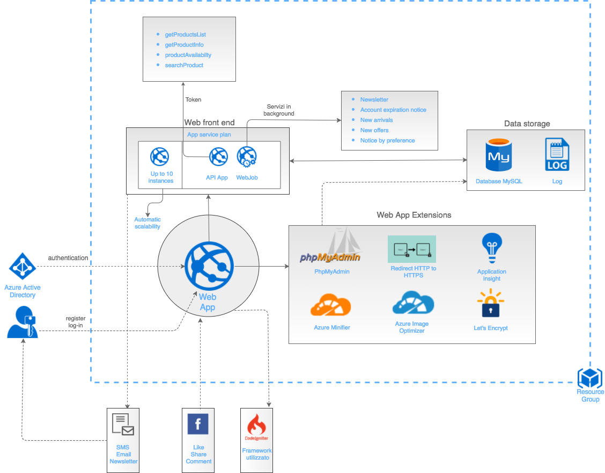
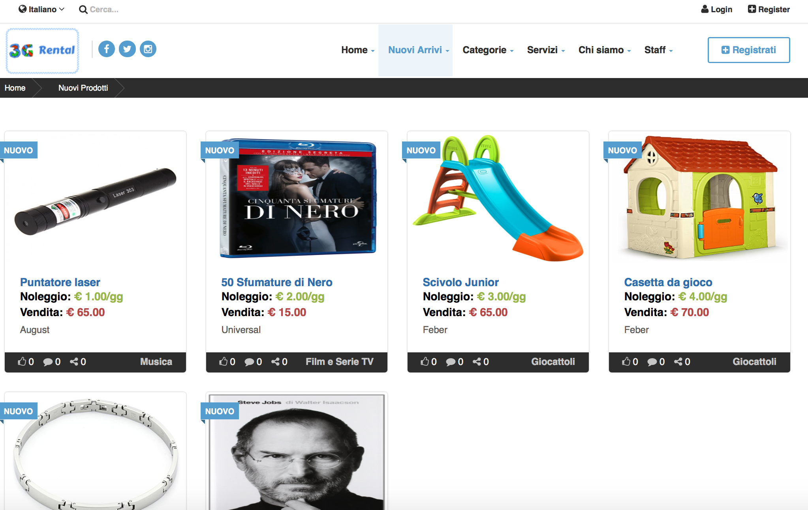
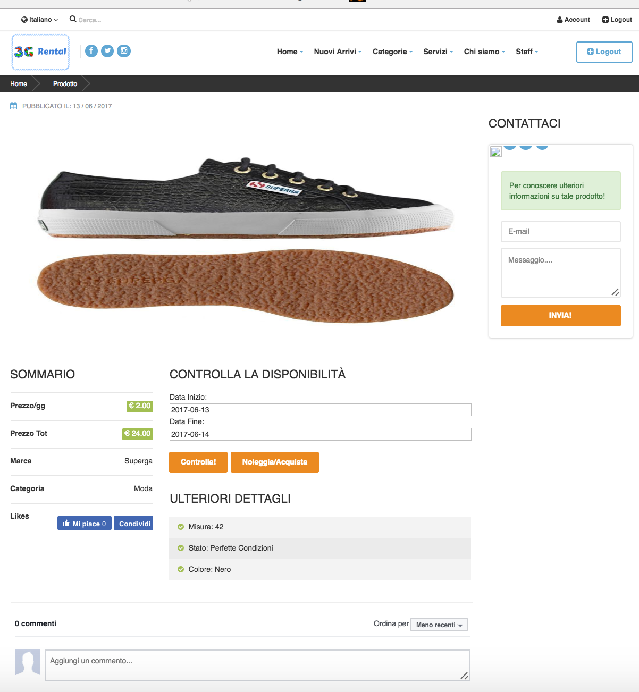

# 3G-Rental: Documentazione
La seguente documentazione si divide in tre parti:
- **Idea della start-up 3G-Rental**
- **Infrastruttura ed architettura Azure**
- **Presentazione interattiva del funzionamento della web app**
## Idea della start-up

La nostra idea di start-up, denominata <i>3G Rental</i>, nasce dagli studenti Giuseppe Giliberto, Giuseppe Puglisi, Giuseppe Sgroi, ed ha come obiettivo principale quello di creare una nuova forma di noleggio tra privati che cambia il concetto di possesso,  trasformandolo in quello di reale utilizzo. Inoltre, la start-up, si propone come mediatrice nella compravendita di beni e servizi.

L’azienda si inserisce nel panorama della <i>Sharing Economy</i>, mercato  che si propone come nuovo modello economico che parte dai reali bisogni dei consumatori ed è capace di far fronte alle sfide della crisi, e di promuovere forme di consumo più consapevoli, basate sul riuso anziché sull’acquisto. Vengono stimolati, così, nuovi stili di vita che riescono a favorire il risparmio, la riduzione degli sprechi, la socializzazione e la salvaguardia dell’ambiente.

La nostra azienda ha come nucleo operativo una sede, situata a Catania. Al momento questa è l’unica sul territorio regionale, ma contiamo in una continua espansione al fine di raggiungere successivamente anche il territorio nazionale, arrivando a coprire il mercato in larga scala.

Il fulcro della nostra start-up ruota attorno ad una web app, vale a dire un’applicazione fruibile via web, messa a disposizione dell’utente.

Si distinguono due categorie di utenza: noleggiante/venditore, noleggiatore/acquirente.
Per la prima categoria viene messa a disposizione la possibilità di registrarsi e solo in seguito poter procedere alla consegna del bene, il quale verrà inserito solo dopo un’attenta valutazione del personale addetto; superata questa fase verrà preventivato il prezzo di noleggio e/o vendita.
Se viene offerto un servizio, invece, questo verrà direttamente inserito nel sistema, sempre previa supervisione del personale addetto.
Per la seconda categoria di utenza viene messa a disposizione la possibilità, dopo previa registrazione, di bloccare uno o più prodotti specificandone il periodo esatto. Subito dopo l’utente dovrà recarsi in sede a saldare il prezzo del noleggio ed una cauzione calcolata in base al valore del prodotto.

Alla fine di tutto:  il noleggiante guadagnerà la percentuale maggiore, l'azienda la percentuale minore, ed il noleggiatore risparmierà invece di dover acquistare un prodotto nuovo e per l'occasione.
Se invece verrà effettuata una compravendita, l’azienda guadagnerà una sua percentuale, ponendosi da mediatrice.
Gli utenti avranno inoltre la possibilità di aderire a servizi premium che permetteranno loro di avere una determinata serie di benefici: sconti su acquisti e noleggi, newsletter, maggior guadagno sul noleggio e tanto altro.

## Infrastruttura ed architettura Azure

La scelta della nostra infrastruttura come design pattern architetturale ricade su una <i>Scalable Web App</i>, ed  abbiamo optato per il piano di servizio <i>S1 Standard</i> in quanto consone alle nostre disponibilità finanziarie ed architetturali.

Il piano, progettato appositamente per web app, ci mette a disposizione tra gli altri:
<ul type="square">
<li><i>Archiviazione</i>: 50 GB di spazio di archiviazione (ottimo per il nostro <i>Data Storage</i>).</li>
<li><i>Istanze</i>: possibilità di creare fino a dieci istanze dell’app, con scalabilità automatica, in funzione del carico di lavoro ed alle esigenze di traffico. A tale scopo utilizziamo una serie di <i>scale condition rules</i> impostate ad hoc sulla piattaforma.</li>
<li><i>Backup giornalieri</i>.</li>
</ul>

Abbiamo aggiunto come API app le seguenti funzioni:
<ul type="square">
<li><b><i>getProductsList()</i></b>: utilizza una funzione random per ritornare una parte della lista dei prodotti</li>
<li><b><i>getProductInfo()</i></b>: mostra le informazioni di un singolo prodotto</li>
<li><b><i>productAvailability()</i></b>: controlla la disponibilità di un prodotto</li>
<li><b><i>searchProduct()</i></b>: ricerca un prodotto in base a determinati parametri scelti nell'apposita pagina</li>
</ul>

La scelta delle tecnologie utilizzate ricade sul nostro <i>Know-How</i>, ovvero nell’integrare servizi come <i>mySql</i> e <i>PhpMyAdmin</i>, fondamentali per la creazione e gestione grafica del database.
Le altre tecnologie utilizzate sono:
<ul type="square">
<li><b><i>redirect HTTP to HTTPS</i></b>: permette di redirigere tutto il traffico HTTP su protocollo HTTPS. La scelta di questo protocollo ci assicura di avere informazioni crittografate e dunque più sicure.</li>
<li><b><i>Azure minifier</i></b>: permette di ridurre le dimensioni dei file con estensione .css o .js.</li>
<li><b><i>Azure Image Optimizer</i></b>: permette di comprimere le immagini sul sito web.</li>
<li><b><i>Let’s Encrypt</i></b>: automatizza gratuitamente la creazione, la validazione, il rilascio o il rinnovo dei certificati TLS/SSL.</li>
<li><b><i>Application Insight</i></b>: offre funzionalità avanzate di management, come: monitoraggio delle prestazioni, analisi interattiva dei dati, gestione e recupero degli errori e delle eccezioni, machine learning, e varie diagnostiche.</li>
</ul>

La nostra Web App è stata inoltre pensata per eseguire attività in background con processi Web (<i>WebJobs</i>) quali:
<ul type="square">
<li><b><i>Newsletter</i></b>: ha lo scopo di informare, tramite e-mail, gli utenti riguardo nuovi prodotti ed offerte, o di evidenziare le novità pubblicate sul sito web. Per questo servizio, inoltre, presupponiamo il futuro impiego di algoritmi di machine learning per offrire un contenuto più appropriato ad ogni utente, in base alle preferenze dei prodotti acquistati/noleggiati.</li>
<li><b><i>Account expiration notice</i></b>: ha lo scopo di notificare all'utente che la sua sottoscrizione premium sta per scadere e verranno, quindi, ripristinate le funzionalità standard del suo account.</li>
<li><b><i>New arrivals</i></b>: ha lo scopo di mostrare all’utente i nuovi prodotti inseriti. Inoltre, anche qui, presupponiamo il futuro impiego di algoritmi di machine learning per offrire un contenuto più appropriato ad ogni utente.</li>
<li><b><i>New offers</i></b>: ha lo scopo di evidenziare le novità riguardanti le nuove offerte come prodotti scontati od offerte riservate agli utenti premium.</li>
<li><b><i>Notice by preference</i></b>: ha lo scopo di mostrare soltanto i prodotti per una determinata categoria.</li>
<li><b><i>Availability and delivery notice of the product</i></b>: ha lo scopo di avvisare l’utente, tramite e-mail, l’arrivo del prodotto desiderato (quindi disponibile per noleggio/acquisto) e quindi la sua relativa consegna, una volta terminato il periodo di noleggio.</li>
</ul>

La web app è totalmente integrata con il social network Facebook&trade; ed è stata progettata utilizzando il framework CodeIgniter&trade; 
In Futuro verranno implementate anche i servizi di gestione del traffico per regione, dopo l’apertura della nuova filiale.
Inoltre conteremo di integrare un sistema di pagamento e un sistema di consegna, all'interno della web app, in modo tale da renedere più immediata la transazione e la consegna. 

## Presentazione interattiva del funzionamento della web app

### Sezione <i>Home</i>

Nella homepage, l'utente ha la possibilità di visionare tutti i vari prodotti, consulatare informazioni dettagliate riguardo il prodotto selezionato, e verificare se tale prodotto è disponibile o meno nella data selezionata.
Su ogni riquadro del prodotto appare sotta la possibilità di utilizzare le funzioni Facebook&trade; di commento, like e condivisione. inoltre nella sezione Home l'utente può fare il log-in o la regostrazione con l'apposito button.

### Sezione <i>Nuovi arrivi</i>

Nella homepage, l'utente ha la possibilità di visionare tutti i vari prodotti, consulatare informazioni dettagliate riguardo il prodotto selezionato, e verificare se tale prodotto è disponibile o meno nella data selezionata.
Su ogni riquadro del prodotto appare sotta la possibilità di utilizzare le funzioni Facebook&trade; di commento, like e condivisione.

La pagina dei Nuovi Arrivi è in costante aggiornamento in quanto mostra gli ultimi prodotti inseriti con cadenza setimanale.

### Sezione <i>Prodotto</i>

All'interno della sezione Prodotto l'utente potrà impostare il periodo di noleggio desideratocon la possibilità di controllare la disponibilità ed in caso affermativo procedere alla prenotazione. Inoltre all'interno di questa sezione, verranno mostrati tutti i dettagli del prodotto in questione.

